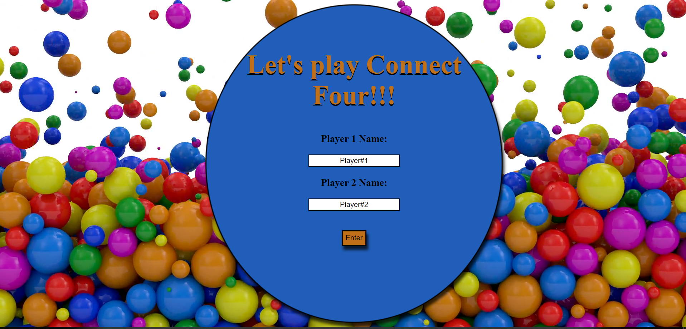
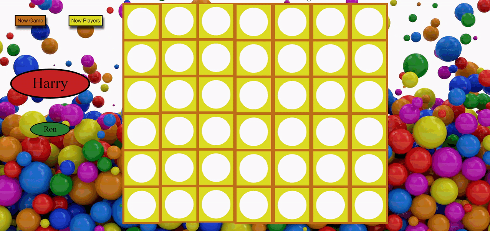
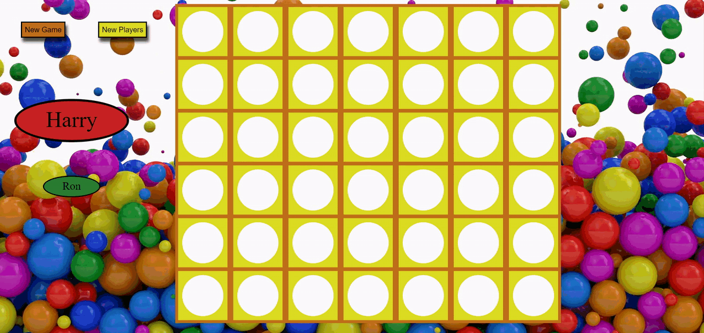

# Overview

Connect Four is a two-player, vertical checkers game.

In the first screen, the players write their names, or leave it as the default, as Player#1 and Player#2, then they take turns dropping their pieces into a seven-column, six-row board. The first player to get their pieces into four slots that are vertically, horizontally, or diagonally contiguous wins the game.

# Features

-   When a player wins, the 4 connected pieces are showing a rainbow gif.
-   When a player wins, a message appears to announce the victory.
-   By pressing on the **New Game** button, the board is cleared and the game restart.
-   By pressing on the **New Players** button, the game restart and the name screen is appearing, allowing the players to insert new names.

# Technology

-   jQuery
-   HTML5
-   CSS3

# Preview

Enter Screen:

Vertical Win:

Horizontal Win:

Diagonal Win:

